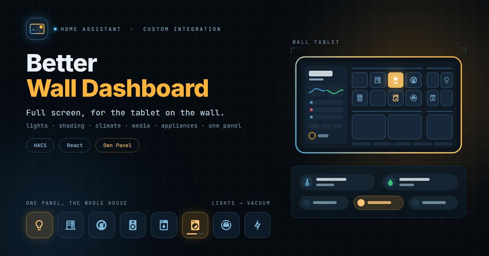

# Better Wall Dashboard



A Home Assistant integration that puts a full-screen dashboard for wall tablets into the sidebar.

It is not a Lovelace dashboard. It is one React app that Home Assistant serves as a panel and
hands its own connection to, so there is no stack of custom cards to re-render on every state
change, no grid measured before it has a size, and no card-mod reaching through five shadow
roots. The layout scales to the screen it is on: a 7″ tablet, a 1280×800 wall panel and a 4K
monitor draw the same dashboard at their own size, and every tile on it stays square.

Everything is configured from your desk, as an admin, in its own **Wall Dashboard Editor** —
a separate, admin-only sidebar entry with a live preview at your tablet's size — and stored
inside Home Assistant. The tablet on the wall just shows it, and redraws the moment you save.

> **Status: early.** The layout, the sidebar and the editor are here. The device controls for
> the tiles (lights, shading, climate, media, appliances, vacuum …) come next, as components in
> the tile library.

## What is on it

**The sidebar**, top to bottom:

- **Clock and date**, in your locale.
- **Status icons** that appear only while their mode is on — absence, guests, night — and the
  **Wi-Fi symbol**, which shows the tablet's own signal strength and opens the **guest Wi-Fi QR
  code**.
- **Temperature and humidity** of the room the tablet hangs in, each with a day of history drawn
  the way [mini-graph-card] draws it. Tap either for the detailed history.
- **People** and where they are: home, away, or the zone they are in.
- **Open windows and doors**, counted, red when any are open. Tap for the list.
- **Travel time to work**, from the Google Travel Time sensor, with the route on a map.
- **Quick actions**: three to six toggles for modes like night or guests.
- **Upcoming events** from your Home Assistant calendars.
- **Weather** with an animated icon, the temperature from your own outdoor sensor, and the
  forecast behind a tap.
- **Notifications** with an unread count, and **settings** with system statistics.

**The pages** to the right swipe sideways — with a finger on the tablet, or by dragging with the
mouse on a PC. Each page is a grid of up to four sections — 75/25
across and 50/50 down by default — and each section has a header (icon, name, up to two readings)
over a grid of tiles. Every 1×1 tile on the dashboard is the same size and a bigger tile is a whole
multiple of it, so everything lines up. The cell takes the shape the screen has room for, but
never more than 3:2, so tiles fill their section without being stretched.

**The button bar** along the bottom: up to five buttons, each opening a popup of tiles. The first
is the **Intercom** — where the doorbell's camera, talk-back, door opener and canned spoken replies
are going, opening by itself when somebody rings.

## Several tablets, several dashboards

Make as many dashboards as you have tablets. Each has its own sidebar (its room's sensors, its
own Wi-Fi signal sensor), its own pages and its own buttons. Then, per Home Assistant user:

| Setting | What it does |
| --- | --- |
| **Dashboard** | Which dashboard that user sees. Give each tablet its own user. |
| **Kiosk** | Hides Home Assistant's sidebar while the dashboard is open, for a true full screen. Hold the clock for three seconds to get the sidebar back. |
| **Opens on start** | Makes the dashboard that user's start page, so a tablet that reboots lands on it. (Home Assistant's own profile picker cannot choose a custom panel; this sets the same setting directly.) |

All three live in the editor's **Users** tab.

## Installation

### HACS

1. HACS → ⋮ → **Custom repositories** → add `https://github.com/Sweezy98/ha-better-wall-dashboard`
   as an **Integration**.
2. Install **Better Wall Dashboard**, then restart Home Assistant.
3. **Settings → Devices & services → Add integration → Better Wall Dashboard.**

**Wall Dashboard** now appears in the sidebar for every user, and **Wall Dashboard Editor** for
admins.

### Manually

Copy `custom_components/better_wall_dashboard` into your Home Assistant's
`config/custom_components/`, restart, and add the integration as above. The folder already
contains the built dashboard; there is nothing to build.

Requires Home Assistant **2026.3** or newer.

## Setting it up

Open **Wall Dashboard Editor** from the sidebar. Pick a dashboard at the top, or make a new one;
the right half shows it as a chosen tablet would — 10″, 11″, 12″, Full HD, a 7″ panel, in
landscape or portrait — updating as you type. Nothing reaches the tablets until you **Save**.

- **General** — name, background image (e.g. `/local/wall.jpg`), how much to darken and blur it.
- **Sidebar** — the entities for each block. Anything left empty simply is not drawn.
- **Pages** — sections, their size in cells, their header readings, and their tiles.
- **Buttons** — the bottom bar and what each popup contains.
- **Users** — which dashboard each person sees, kiosk mode, start page.
- **JSON** — the whole dashboard as stored, for copying between dashboards or bulk edits.

Save, and every tablet showing that dashboard updates immediately.

### Where the sidebar's data comes from

| Block | Entity |
| --- | --- |
| Wi-Fi signal | The companion app's *Wi-Fi signal strength* sensor on the tablet (`sensor.<tablet>_wifi_signal_strength`). |
| Guest Wi-Fi code | The [UniFi] integration's QR-code image entity for the network — or type the network name and password, and the code is drawn for you. |
| Room climate | Any temperature and humidity sensors. |
| Travel time | A [Google Travel Time] sensor. For the map, paste a Google Maps embed URL (Share → Embed a map) or add an API key with the **Maps Embed API** enabled. |
| Calendar | Any `calendar.*` entities. |
| Weather | A `weather.*` entity for the condition and forecast, and optionally your own outdoor temperature sensor. |
| Notifications | Home Assistant's persistent notifications. An automation that runs `persistent_notification.create` shows up here; set an id prefix (e.g. `wall_`) to show only yours. |

### Privacy

Nothing about your house is in this repository or in the dashboard's code. The configuration —
entities, the guest network's name and password, a Maps key — is stored in your Home Assistant
(`.storage/better_wall_dashboard`) and sent to the dashboard over Home Assistant's own
authenticated connection. Anyone who can open the dashboard can see what it shows, including the
guest Wi-Fi password in its popup; that is the point of it, but keep it in mind for the Maps key.

## Updating

Update through HACS and reload the integration. A tablet already on the wall keeps running the
version it loaded; open **settings** on it and tap **Reload the dashboard**. It fetches the new
version past the app's cache without throwing away the rest of Home Assistant's.

## Development

The integration is Python under `custom_components/better_wall_dashboard/`. The dashboard is a
React + TypeScript + Vite app under [`frontend/`](frontend), built with [ha-component-kit] and
styled-components.

```bash
# backend
uv venv --python 3.14 .venv
uv pip install --python .venv/bin/python homeassistant pytest-homeassistant-custom-component home-assistant-frontend ruff
.venv/bin/python -m pytest tests

# frontend
cd frontend
nvm use && npm ci
cp .env.example .env                          # your Home Assistant's URL
cp .env.development.example .env.development  # a long-lived access token
npm run dev      # the dashboard against your Home Assistant, with hot reload (/#editor: the editor)
npm run check    # prettier, eslint, tsc, vitest
npm run build    # into custom_components/better_wall_dashboard/frontend
npm run deploy   # copy the integration to your Home Assistant over SSH
```

The dev server needs the integration installed on the Home Assistant it talks to, because the
dashboard's configuration lives there.

HACS copies files and runs nothing, so **the build is committed**, inside the integration. CI
rebuilds it and fails if the result differs from what is committed. `.env` files are never
committed; a test fails if a token, an instance URL or an entity id from one particular house
ever appears in a tracked file.

The brand images and the header above are HTML in [`images/`](images), rendered by
`scripts/make_brand_images.sh`.

## Credits

- The design follows Jimmy Landry's [HA-Tablet-Dashboard-Config], and borrows its look from [Bubble Card] and
  [mini-graph-card] — the graph here is a port of mini-graph-card's own algorithm.
- Animated weather icons: [Meteocons] by Bas Milius (MIT).
- Built on [ha-component-kit] by Shannon Hochkins.
- Sibling of [Better Lighting].

## License

MIT

[mini-graph-card]: https://github.com/kalkih/mini-graph-card
[Bubble Card]: https://github.com/Clooos/Bubble-Card
[HA-Tablet-Dashboard-Config]: https://github.com/jimmy-landry/HA-Tablet-Dashboard-Config
[ha-component-kit]: https://github.com/shannonhochkins/ha-component-kit
[Meteocons]: https://github.com/basmilius/weather-icons
[UniFi]: https://www.home-assistant.io/integrations/unifi/
[Google Travel Time]: https://www.home-assistant.io/integrations/google_travel_time/
[Better Lighting]: https://github.com/Sweezy98/ha-better-lighting
