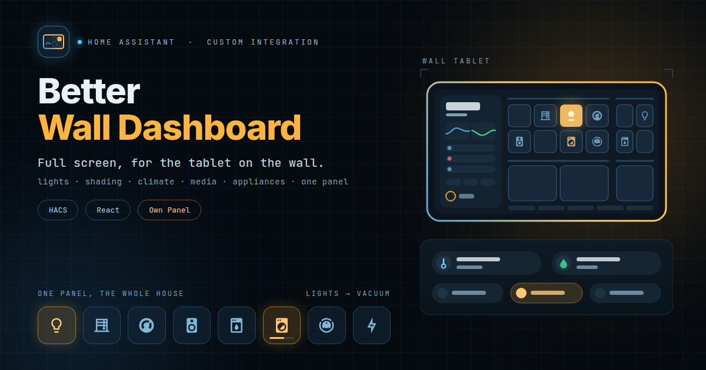

# Better Wall Dashboard



A Home Assistant integration that puts a full-screen dashboard for wall tablets into the sidebar.

It is not a Lovelace dashboard. It is one React app that Home Assistant serves as a panel and
hands its own connection to, so there is no stack of custom cards to re-render on every state
change, no grid measured before it has a size, and no card-mod reaching through five shadow
roots. The layout scales to the screen it is on: a 7″ tablet, a 1280×800 wall panel and a 4K
monitor draw the same dashboard at their own size, and every tile on it stays square.

Everything is configured from your desk, as an admin, in its own **Wall Dashboard Editor** —
a separate, admin-only sidebar entry with a live preview at your tablet's size — and stored
inside Home Assistant. The tablet on the wall just shows it, and redraws the moment you save.

## What is on it

### The sidebar

Top to bottom, each block drawn only once it is configured:

- **Clock and date**, in your locale — digital, with or without seconds, or analog. Hold it for
  three seconds to get Home Assistant's own sidebar back in kiosk mode.
- **Status icons** that appear only while their mode is on — absence, guests, night, anything you
  pick — and the **Wi-Fi symbol**, which shows the tablet's own signal strength and opens the
  **guest Wi-Fi QR code**.
- **Temperature and humidity** of the room the tablet hangs in, each with a day of history drawn
  the way [mini-graph-card] draws it. Tap either for the detailed history.
- **People** and where they are: home, away, or the zone they are in.
- **Open windows and doors**, counted, red when any are open; if you like, shown only while
  something is open. Tap for the list — everything, or only what is open.
- **Batteries**: every battery Home Assistant knows of, found by itself, so one added tomorrow
  shows too. Counted when they run low (at a threshold you set), red then; if you like, shown
  only while one is. Tap for the list, the emptiest first — or only those running out. Leave out
  the ones you do not care about, such as a phone's.
- **Travel time to work**, from the Google Travel Time sensor, with the route on a map to a work
  location of your choice (a zone or an address).
- **Quick actions**: up to six toggles for modes like night or guests, each shown only while its
  **rules** hold — an entity's state or value, a time of day, day or night, someone home or not.
- **Upcoming events** from your Home Assistant calendars, for as many days as you choose.
- **Weather** with an animated icon, the temperature from your own outdoor sensor, and the
  forecast behind a tap — with pressure, the moon's phase drawn as it is tonight (with Home
  Assistant's Moon integration) and nearby lightning (with [Blitzortung]).
- **Notifications** with an unread count, filtered by id prefix if you like.
- **Settings**: system statistics with their graphs, up to twelve **actions** — restarting Home
  Assistant, letting devices join the Zigbee network, any button, script or scene, the risky ones
  asking for a second tap; a switch shows whether it is on and can say something different in
  each state — and a **reload** that fetches a new version past the app's cache. For an admin
  looking at the dashboard in Home Assistant, also: open the editor, hide or show Home Assistant's
  sidebar in this tab only, and full screen.

### The pages

The pages to the right swipe sideways — with a finger on the tablet, or by dragging with the
mouse on a PC. Each page is a grid of up to four sections — 75/25 across and 50/50 down by
default — and each section has a header (icon, name, up to two readings, each with an icon of
its own if you like; a moment such as a phone's next alarm reads as *In 18 hours*) over a grid of
tiles. Every 1×1 tile on the dashboard is the same size and a bigger tile is a whole multiple of
it, so everything lines up.

### The tiles

Picked from a library in the editor; each offers only the entities it can work with.

- **Entity button** — switches, toggles, runs or presses one thing. A **double tap on a light**
  opens it up close: on and off, brightness, colour and white in one tall control, colour presets
  (hidden per tile if you like), and each lamp of a group on its own row.
- **Sensor with graph** — a reading with its last day; a tap shows the history.
- **Cover** — where a blind stands, with up, stop and down (stop only while it moves, if your
  cover reports that), up to four favourite positions, and its position to drag on a double tap.
- **Better Lighting room** — where [Better Lighting] is installed: switched by its icon, how it is
  lit and why (presence, night, by hand or automatically, the countdown to switching off), a
  brightness bar in the room's own colour, its scenes a step either way or all a tap away, back to
  adaptive in one press, and one extra button of your choice.
- **Adaptive Cover Pro** — a cover [Adaptive Cover Pro] steers: signs of what is steering it
  (auto, solar tracking, cloudy, climate, a hand's hold with its end time and a press to give it
  back; the sun not on the window yet, so nothing needed doing). A double tap opens the details:
  target and position, the cover's controls and presets, its switches, each step of its decision,
  the window and the sun on a sky compass, today's plan and the last day as charts to touch for
  their values, and the activity log.
- **Media player** — see [below](#the-media-player-tile).

A tap gives the button pressed a little bounce, and a tile that is on wears a shine in its own
colour. Hover anything with more to say for a tooltip.

### The media player tile

What plays, with its album art behind it: the source, title and artist, where it is in the track,
previous / play / next, a **power button** for the device of your choice and the **volume** of the
device of your choice — in dB for a Denon receiver. It shows whichever of its players has the most
going on, so the streaming box that plays wins over the receiver it plays through.

A **double tap** opens the whole system on one screen, with its own power button at the top:

- **Sources** along the top: what plays now, and presets that switch to another — a receiver's
  input, an app on an Android TV box, or a script or scene.
- **Audio**: the sound mode, the source's channels (*7.1*), decoder, input signal and sample rate
  where the receiver reports them; the **volume** with quieter, mute and louder; **night mode**.
- **The room in 3D**: your speakers — any layout from 2.0 to 9.4.6, with front wides on stands
  for nine at ear height — where they stand, each aimed at the seat, lit while the receiver plays
  through it: Atmos, DTS:X and the upmixers fill them all, stereo the front pair, a plain decoder
  the source's own channels. The height speakers hang high on the wall or sit round in the
  ceiling, facing down — front and rear chosen on their own. A subwoofer whose outlet, or the
  receiver's own subwoofer output, is switched off is drawn switched off; with the receiver off,
  every speaker is. Optionally with an L-shaped or straight sofa, a listener on it — lying down
  asleep while everything is off, if you like — no walls, and turned, panned and zoomed by hand.
  The screen lights up with the TV: what is playing, or a picture of your own, at the size and
  fill you choose (whole, cropped to fill, or stretched).
- **Devices and outlets**: the TV and the box with their power and what they show (*4K HDR*,
  *HDMI 3*), and the outlets to switch, such as the subwoofers'.
- **The player** along the foot: the track to drag, shuffle, repeat, previous, play, next, stop.

### The rest

- **The button bar** along the bottom: up to five buttons, each opening a popup of tiles.
- **The background** is a picture — the built-in one, your own, or one from the media library —
  or a plain colour, darkened and blurred as you like.
- **It looks after itself on the wall.** While Home Assistant restarts it says so and reconnects
  by itself; a tab left in the background comes back as it was; and should anything fail to draw,
  it says so and reloads by itself a moment later.

## Several tablets, several dashboards

Make as many dashboards as you have tablets. Each has its own sidebar (its room's sensors, its
own Wi-Fi signal sensor), its own pages and its own buttons. Then, per Home Assistant user:

| Setting | What it does |
| --- | --- |
| **Dashboard** | Which dashboard that user sees. Give each tablet its own user. |
| **Kiosk** | Hides Home Assistant's sidebar while the dashboard is open, for a true full screen. Hold the clock for three seconds to get the sidebar back. |
| **Opens on start** | Makes the dashboard that user's start page, so a tablet that reboots lands on it. (Home Assistant's own profile picker cannot choose a custom panel; this sets the same setting directly.) |

All three live in the editor's **Users** tab.

## Installation

### HACS

1. HACS → ⋮ → **Custom repositories** → add `https://github.com/Sweezy98/ha-better-wall-dashboard`
   as an **Integration**.
2. Install **Better Wall Dashboard**, then restart Home Assistant.
3. **Settings → Devices & services → Add integration → Better Wall Dashboard.**

**Wall Dashboard** now appears in the sidebar for every user, and **Wall Dashboard Editor** for
admins.

### Manually

Copy `custom_components/better_wall_dashboard` into your Home Assistant's
`config/custom_components/`, restart, and add the integration as above. The folder already
contains the built dashboard; there is nothing to build.

Requires Home Assistant **2026.3** or newer.

## Setting it up

Open **Wall Dashboard Editor** from the sidebar. Pick a dashboard at the top, or make a new one;
the right half shows it as a chosen tablet would — 10″, 11″, 12″, Full HD, a 7″ panel, in
landscape or portrait — updating as you type. Nothing reaches the tablets until you **Save**.

- **General** — name, background image (e.g. `/local/wall.jpg`), how much to darken and blur it.
- **Sidebar** — the entities for each block. Anything left empty simply is not drawn.
- **Pages** — sections, their size in cells, their header readings, and their tiles. **Add tile**
  opens a picker of every tile type there is, each with what it is for.
- **Buttons** — the bottom bar and what each popup contains.
- **Users** — which dashboard each person sees, kiosk mode, start page.
- **JSON** — the whole dashboard as stored, for copying between dashboards or bulk edits.

Save, and every tablet showing that dashboard updates immediately.

### Where the sidebar's data comes from

| Block | Entity |
| --- | --- |
| Wi-Fi signal | The companion app's *Wi-Fi signal strength* sensor on the tablet (`sensor.<tablet>_wifi_signal_strength`). |
| Guest Wi-Fi code | The [UniFi] integration's QR-code image entity for the network — or type the network name and password, and the code is drawn for you. |
| Room climate | Any temperature and humidity sensors. |
| Travel time | A [Google Travel Time] sensor. For the map, paste a Google Maps embed URL (Share → Embed a map) or add an API key with the **Maps Embed API** enabled. |
| Calendar | Any `calendar.*` entities. |
| Weather | A `weather.*` entity for the condition and forecast, and optionally your own outdoor temperature sensor. |
| Notifications | Home Assistant's persistent notifications. An automation that runs `persistent_notification.create` shows up here; set an id prefix (e.g. `wall_`) to show only yours. |
| Batteries | Found by themselves: every sensor of device class *battery* (a percentage) and every binary sensor of that class (on when low). |
| Actions | Buttons, scripts, scenes, automations (triggered, not toggled) and switches. A restart is a script calling `homeassistant.restart`; Zigbee pairing is Zigbee2MQTT's *permit join* switch or a ZHA script. |

### Setting up the media player tile

An example: a receiver the sound goes through, a streaming box (Android TV / NVIDIA Shield) and a
TV, all on HDMI-CEC.

| Setting | What to choose |
| --- | --- |
| **Entity** | The receiver's media player — its volume, sound mode and its own streams (Tidal Connect, Bluetooth, HEOS). |
| **Further players** | The box's Google Cast player first (it knows the title and the art), then its Android TV Remote player, then the TV. The tile shows whichever has the most going on. |
| **Power button switches** | The box's Android TV Remote player: switching it on wakes the receiver and the TV by CEC. |
| **Volume of** | The receiver. |
| **Source presets** | *Choose an input* on the receiver for its own sources; *Open an app* on the box's Android TV Remote player with the app's package (`com.plexapp.android`, `com.google.android.youtube.tv`); *Choose an input* on the TV for its own apps. |
| **Devices** | The TV and the box, each with a sensor for what it shows if you have one. |
| **Outlets** | The subwoofers' switches, each ticked for the subwoofers it powers — so they are drawn switched off when they are. |
| **Night mode** | A script or switch that sets the receiver's night settings and turns the subwoofers off. |
| **TV switched on** | The TV's media player, so the room's screen lights with it. |
| **Subwoofer output** | Found by itself with the Denon HACS integration (its *Subwoofer* switch); otherwise any switch. |
| **Speakers in the room** | Your layout (e.g. 7 at ear height, 4 subwoofers, 4 height speakers), how the heights are mounted, and your sofa. |

For a Denon or Marantz receiver, Home Assistant's own [Denon AVR] integration gives the volume in
dB and the sound mode, which is enough for Atmos, DTS:X, the upmixers and stereo. Which speakers a
plain Dolby Digital or DTS source plays on needs its channels, which the [Denon AVR (HACS)]
integration adds as sensors — the tile finds them on the receiver by itself.

### Privacy

Nothing about your house is in this repository or in the dashboard's code. The configuration —
entities, the guest network's name and password, a Maps key — is stored in your Home Assistant
(`.storage/better_wall_dashboard`) and sent to the dashboard over Home Assistant's own
authenticated connection. Anyone who can open the dashboard can see what it shows, including the
guest Wi-Fi password in its popup; that is the point of it, but keep it in mind for the Maps key.

## Updating

Update through HACS and reload the integration. A tablet already on the wall keeps running the
version it loaded; open **settings** on it and tap **Reload the dashboard**. It fetches the new
version past the app's cache without throwing away the rest of Home Assistant's.

## Development

The integration is Python under `custom_components/better_wall_dashboard/`. The dashboard is a
React + TypeScript + Vite app under [`frontend/`](frontend), built with [ha-component-kit] and
styled-components.

```bash
# backend
uv venv --python 3.14 .venv
uv pip install --python .venv/bin/python homeassistant pytest-homeassistant-custom-component home-assistant-frontend ruff
.venv/bin/python -m pytest tests

# frontend
cd frontend
nvm use && npm ci
cp .env.example .env                          # your Home Assistant's URL
cp .env.development.example .env.development  # a long-lived access token
npm run dev      # the dashboard against your Home Assistant, with hot reload (/#editor: the editor)
npm run check    # prettier, eslint, tsc, vitest
npm run build    # into custom_components/better_wall_dashboard/frontend
npm run deploy   # copy the integration to your Home Assistant over SSH
```

The dev server needs the integration installed on the Home Assistant it talks to, because the
dashboard's configuration lives there.

HACS copies files and runs nothing, so **the build is committed**, inside the integration. CI
rebuilds it and fails if the result differs from what is committed. `.env` files are never
committed; a test fails if a token, an instance URL or an entity id from one particular house
ever appears in a tracked file.

The brand images and the header above are HTML in [`images/`](images), rendered by
`scripts/make_brand_images.sh`.

## Credits

- The design follows Jimmy Landry's [HA-Tablet-Dashboard-Config], and borrows its look from [Bubble Card] and
  [mini-graph-card] — the graph here is a port of mini-graph-card's own algorithm.
- Animated weather icons: [Meteocons] by Bas Milius (MIT).
- Built on [ha-component-kit] by Shannon Hochkins.
- Sibling of [Better Lighting].

## License

MIT

[mini-graph-card]: https://github.com/kalkih/mini-graph-card
[Bubble Card]: https://github.com/Clooos/Bubble-Card
[HA-Tablet-Dashboard-Config]: https://github.com/jimmy-landry/HA-Tablet-Dashboard-Config
[ha-component-kit]: https://github.com/shannonhochkins/ha-component-kit
[Meteocons]: https://github.com/basmilius/weather-icons
[UniFi]: https://www.home-assistant.io/integrations/unifi/
[Google Travel Time]: https://www.home-assistant.io/integrations/google_travel_time/
[Better Lighting]: https://github.com/Sweezy98/ha-better-lighting
[Adaptive Cover Pro]: https://github.com/jrhubott/adaptive-cover-pro
[Blitzortung]: https://github.com/mrk-its/homeassistant-blitzortung
[Denon AVR]: https://www.home-assistant.io/integrations/denonavr/
[Denon AVR (HACS)]: https://github.com/LaserGuruGuy/denon_avr
